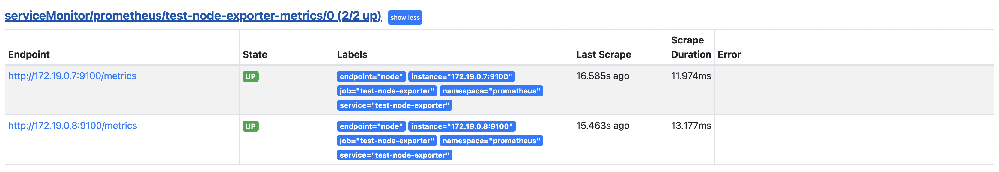

# k8s 외부의 매트릭 수집

Prometheus Operator는 ServiceMonitor 오브젝트의 정보를 토대로 매트릭을 수집하며, Service 오브젝트의 endpoints ip 정보를 이용합니다.

외부 인스턴스의 매트릭을 수집하기 위해 ServiceMonitor와 Service, Endpoints작성이 필요합니다.

## 실습

**정보**

- kubernets tool: docker - kind
- Kubernetes version: v1.22.9
- helm charts: prometheus-community/kube-prometheus-stack

- 하나의 serviemonitor 오브젝트로 다중 인스턴스 수집 확인을 위해 node-exporter를 docker로 2개 실행합니다.

1. kind를 이용하여 kubernetes를 실행합니다.

   TODO: 실행 방법 추가

2. kube-prometheus-stack을 배포합니다.

   ```bash
   helm install -n prometheus --create-namespace \
   prometheus prometheus-community/kube-prometheus-stack \
   --set prometheus.ingress.enabled=true \
   --set prometheus.ingress.ingressClassName=nginx \
   --set 'prometheus.ingress.hosts[0]=prometheus.127.0.0.1.sslip.io' \
   --set 'prometheus.ingress.paths[0]=/'
   ```

3. node-exporter를 실행합니다.

   ```bash
   docker run -d --network kind \
   --name node-exporter1 \
   quay.io/prometheus/node-exporter
   
   docker run -d --network kind \
   --name node-exporter2 \
   quay.io/prometheus/node-exporter
   ```

4. node-exporter의 ip주소를 체크합니다.

   ```bash
   docker network inspect kind
   ```

5. ServiceMonitor, Service, Endpoints를 작성합니다.

   ```yaml
   apiVersion: monitoring.coreos.com/v1
   kind: ServiceMonitor
   metadata:
     labels:
       app: test-node-exporter
       release: prometheus
     name: test-node-exporter-metrics
     namespace: prometheus
   spec:
     selector:
       matchLabels:
         app: test-node-exporter
         release: prometheus
     endpoints:
       - interval: 30s
         port: node
   
   ---
   apiVersion: v1
   kind: Service
   metadata:
     name: test-node-exporter
     namespace: prometheus
     labels:
       app: test-node-exporter
       release: prometheus
   spec:
     # externalName: node-exporter1
     ports:
     - name: node
       port: 9100
       protocol: TCP
       targetPort: 9100
     type: ClusterIP
   
   ---
   apiVersion: v1
   kind: Endpoints
   metadata:
     name: test-node-exporter
     namespace: prometheus
     labels:
       app: test-node-exporter
       release: prometheus
   subsets:
   - addresses:
     - ip: [node-exporter1-ip]
     - ip: [node-exporter2-ip]
     ports:
     - name: node
       port: 9100
       protocol: TCP
   ```

6. prometheus 접속 후 targets에서 test-node-exporter가 정상적으로 scrape하는지 확인합니다.

   - prometheus.127.0.0.1.sslip.io 접속
   - Status -> Targets 클릭
   - Scrape 확인

   

